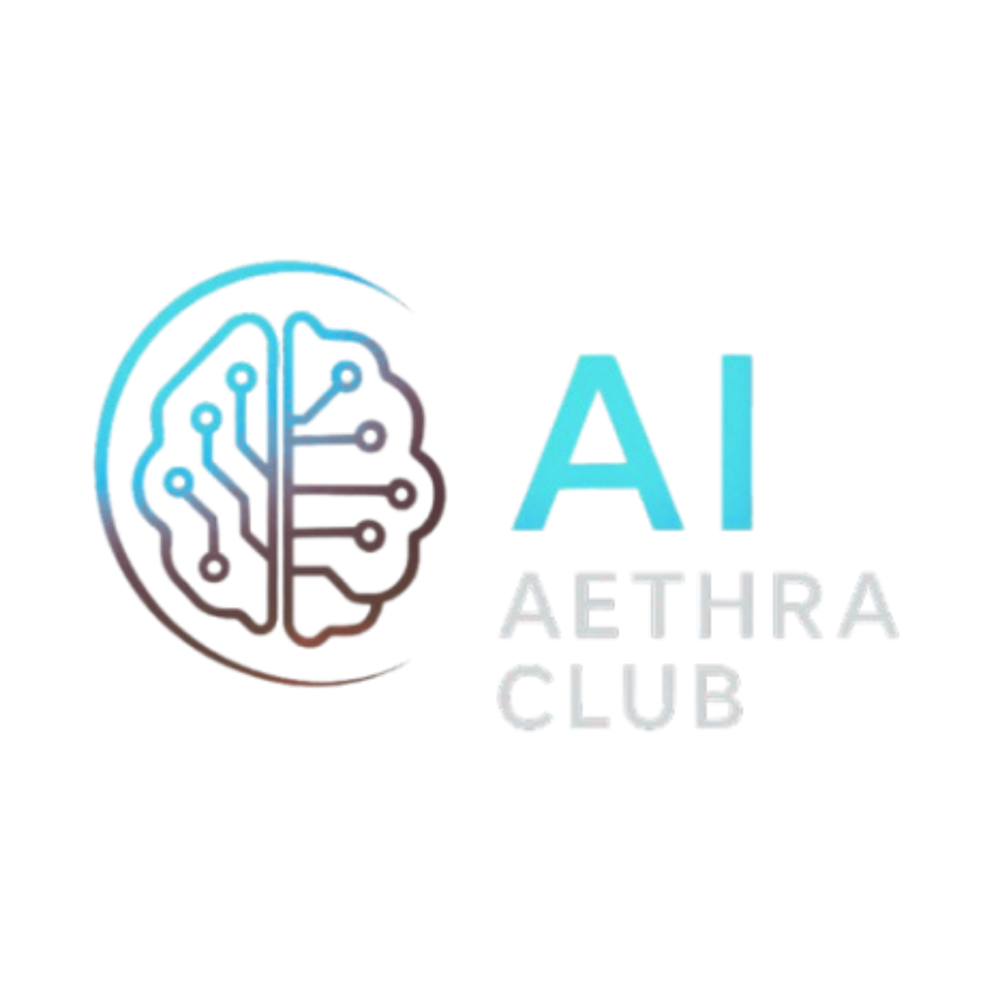

<<<<<<< HEAD

# 🚀 AI AETHRA TCET - Official  Website

<div align="center">
  
  
  [](https://reactjs.org/)
  [](https://vitejs.dev/)
  [](https://tailwindcss.com/)
  [](https://www.framer.com/motion/)
  
  **Modern, Responsive & Animated Website for AI AETHRA TCET**  
  **Thakur College of Engineering and Technology**
</div>

---

## 📋 Table of Contents

- [🌟 About](#-about)
- [✨ Features](#-features)
- [🛠️ Tech Stack](#️-tech-stack)
- [📱 Pages](#-pages)
- [🎨 Design Highlights](#-design-highlights)
- [🚀 Getting Started](#-getting-started)
- [📁 Project Structure](#-project-structure)
- [🔧 Configuration](#-configuration)
- [📞 Contact Forms](#-contact-forms)
- [🎯 Future Enhancements](#-future-enhancements)
- [👨‍💻 Developer](#-developer)
- [📄 License](#-license)

---

## 🌟 About

The **AI AETHRA TCET Website** is the official digital presence of the AI AETHRA at Thakur College of Engineering and Technology. This modern, fully responsive web application serves as a comprehensive platform for students, faculty, and coding enthusiasts to stay connected with our vibrant tech community.

### 🎯 Purpose

- **Community Hub**: Central platform for all AI AETHRA TCET activities
- **Event Management**: Showcase upcoming and past events
- **Team Showcase**: Highlight our talented team members across different years
- **Project Gallery**: Display innovative projects and achievements
- **Information Portal**: Provide easy access to club information and contact details

---

## ✨ Features

### 🎨 **User Experience**

- ✅ **Fully Responsive Design** - Perfect on all devices (Mobile, Tablet, Desktop)
- ✅ **Dark/Light Mode Toggle** - Automatic theme switching with user preference
- ✅ **Smooth Animations** - Professional Framer Motion animations throughout
- ✅ **Interactive Navigation** - Sticky navbar with hover effects and mobile menu
- ✅ **First-Visit Popup** - Welcome popup for new visitors announcing latest events

### 📄 **Dynamic Content**

- ✅ **Data-Driven Architecture** - All content managed through structured data files
- ✅ **Year-wise Team Navigation** - Browse team members by academic year
- ✅ **Event Categories** - Organized display of workshops, competitions, and tech talks
- ✅ **Project Showcase** - Highlight featured projects with descriptions and links
- ✅ **Responsive Cards** - Uniform card layouts with hover effects

### 🔗 **Interactive Elements**

- ✅ **Contact Form Integration** - Direct submission to Google Apps Script
- ✅ **Event Proposal Modal** - Allow students to propose new events
- ✅ **Social Media Integration** - Quick access to all social platforms
- ✅ **Email Integration** - Direct contact options with fallback information

### 🎭 **Visual Design**

- ✅ **Modern Gradient Themes** - Beautiful green-to-blue color schemes
- ✅ **Glassmorphism Effects** - Modern backdrop blur and transparency
- ✅ **Consistent Iconography** - Lucide React icons throughout
- ✅ **Typography Hierarchy** - Clear, readable font scaling
- ✅ **Loading States** - Professional loading indicators for forms

---

## 🛠️ Tech Stack

### **Frontend Framework**

- **React 18** - Modern React with hooks and functional components
- **Vite** - Lightning-fast build tool and development server
- **React Router DOM** - Client-side routing for SPA navigation

### **Styling & Animation**

- **Tailwind CSS** - Utility-first CSS framework for rapid UI development
- **Framer Motion** - Production-ready motion library for React
- **Custom CSS** - Additional styling for specific components

### **UI Components & Icons**

- **Lucide React** - Beautiful, customizable SVG icons
- **SweetAlert2** - Modern, responsive popup boxes
- **Custom Components** - Reusable, modular component architecture

### **External Integrations**

- **Google Apps Script** - Backend for contact forms and event proposals
- **Local Asset Management** - Optimized image and media handling

---

## 📱 Pages

### 🏠 **Home Page**

- **Hero Section**: Animated welcome with background GIF
- **Recent Events**: Latest workshops and competitions
- **Past Events**: Historical event showcase
- **Vision & Mission**: Club objectives and goals
- **First-Visit Popup**: New event announcements

### ℹ️ **About Page**

- **Club History**: Founding and growth story
- **Objectives**: What we aim to achieve
- **Core Values**: Our guiding principles
- **Statistics**: Member count, events organized, achievements

### 👥 **Team Page**

- **Year-wise Navigation**: Browse teams by academic year (2025-2026)
- **Role-based Sections**: Core Team, Working Committee
- **Member Profiles**: Photos, names, positions, and social links
- **Responsive Grid**: Uniform card layouts across all devices

### 📅 **Events Page**

- **Upcoming Events**: Future workshops, competitions, tech talks
- **Event Details**: Date, time, venue, registration links
- **Past Events**: Historical event archive
- **Event Proposal Form**: Students can suggest new events
- **Category Filtering**: Workshop, Competition, Tech Talk categories

### 💼 **Projects Page**

- **Featured Projects**: Highlight innovative student/club projects
- **Project Categories**: Web Development, Mobile Apps, AI/ML, etc.
- **Technology Stacks**: Display tech used in each project
- **Live Demo Links**: Direct access to project demonstrations
- **GitHub Integration**: Source code repositories

### 📞 **Contact Page**

- **Contact Form**: Direct message submission with validation
- **Club Information**: Email, phone, location details
- **Social Media Links**: All platform integrations
- **Interactive Map**: Location finder for college campus
- **Response Management**: Automated email confirmations

---

## 🎨 Design Highlights

### **Typography**

- **Headers**: Bold, gradient text effects
- **Body**: Clean, readable fonts with proper line spacing
- **Responsive**: Scalable text sizes across all devices

### **Animations**

- **Page Transitions**: Smooth fade-in effects
- **Card Hover Effects**: Subtle scale and shadow changes
- **Loading States**: Professional spinner animations
- **Scroll Animations**: Elements animate as they come into view

### **Layout**

- **Grid Systems**: Responsive CSS Grid and Flexbox
- **Spacing**: Consistent padding and margins
- **Mobile-First**: Designed for mobile, enhanced for desktop

---

## 🚀 Getting Started

### **Prerequisites**

- Node.js (v18.0 or higher)
- npm or yarn package manager
- Git for version control

### **Installation**

1. **Clone the repository**

```bash
git clone https://github.com/Prince200510/GFG-TCET.git 
git clone https://github.com/SandeepCodes31/AI-AETHRA-CLUB-Website.git
cd AI AETHRA-TCET

```

2. **Install dependencies**

```bash
npm install
# or
yarn install
```

3. **Start development server**

```bash
npm run dev
# or
yarn dev
```

4. **Open in browser**

```
http://localhost:5173
```

### **Build for Production**

```bash
npm run build
# or
yarn build
```

### **Preview Production Build**

```bash
npm run preview
# or
yarn preview
```

---

## 🔧 Configuration

### **Tailwind CSS Customization**

```javascript
// tailwind.config.js
module.exports = {
  content: ["./index.html", "./src/**/*.{js,ts,jsx,tsx}"],
  darkMode: "class",
  theme: {
    extend: {
      colors: {
        // Custom color palette
      },
      fontFamily: {
        // Custom fonts
      },
    },
  },
};
```

### **Vite Configuration**

```javascript
// vite.config.js
export default defineConfig({
  plugins: [react()],
  server: {
    port: 5173,
    open: true,
  },
  build: {
    outDir: "dist",
    assetsDir: "assets",
  },
});
```

---

## 📞 Contact Forms

### **Form Integration**

- **Backend**: Google Apps Script for form submissions
- **Validation**: Client-side form validation with error handling
- **Feedback**: SweetAlert2 for success/error notifications
- **Email**: Automatic email confirmations and notifications

### **Supported Forms**

1. **General Contact Form** (Contact Page)

   - Name, Email, Message fields
   - Direct submission to club email

2. **Event Proposal Form** (Events Page)
   - Student details, event idea, description
   - Review process for new event suggestions

---

## 🎯 Future Enhancements

### **Planned Features**

- [ ] **Blog Section**: Regular articles and tutorials
- [ ] **Event Registration**: Direct event registration system
- [ ] **Member Portal**: Login system for club members
- [ ] **Achievement Gallery**: Awards and recognition showcase
- [ ] **Resource Library**: Coding resources and tutorials
- [ ] **Newsletter Signup**: Email subscription system
- [ ] **Alumni Network**: Connect with former members
- [ ] **Job Board**: Internship and job opportunities

### **Technical Improvements**

- [ ] **PWA Support**: Progressive Web App capabilities
- [ ] **Performance Optimization**: Code splitting and lazy loading
- [ ] **SEO Enhancement**: Meta tags and structured data
- [ ] **Accessibility**: WCAG compliance improvements
- [ ] **Testing Suite**: Unit and integration tests
- [ ] **CI/CD Pipeline**: Automated deployment workflow

---

## 👨‍💻 Developer

<div align="center">
  
  ### **Prince Maurya**
  *Full Stack Developer & AI AETHRA Website Creator*
  
  **Academic Year**: 2025-2026  
  **Institution**: Thakur College of Engineering and Technology
  
  [](https://github.com/Prince200510/)
  [](https://www.linkedin.com/in/prince-maurya-810b83277/)
  [](https://prince6.netlify.app/)
</div>

### **About the Developer**

Prince Maurya is a passionate full-stack developer and student at TCET, specializing in modern web technologies. This project represents his dedication to creating innovative, user-friendly web applications that serve the college community and promote coding culture.

### **Project Highlights**

- 🎨 **Modern Design**: Implemented glassmorphism and gradient effects
- 📱 **Responsive Layout**: Mobile-first approach with perfect cross-device compatibility
- ⚡ **Performance**: Optimized loading with Vite and efficient component structure
- 🎭 **Animations**: Smooth Framer Motion animations throughout the application
- 🔧 **Integration**: Seamless Google Apps Script integration for form handling

---

## 📄 License

This project is licensed under the **MIT License** - see the [LICENSE](LICENSE) file for details.

### **Usage Rights**

- ✅ Commercial use
- ✅ Modification
- ✅ Distribution
- ✅ Private use

### **Conditions**

- 📄 License and copyright notice
- 🔗 Attribution to original developer

---

<div align="center">
  
  ### 🌟 **Star this repository if you found it helpful!** 🌟
  
  **Made with ❤️ by Prince Maurya && Sandeep Pal**
  
  **Academic Year 2025-2026**
  
  ---
  
  **© 2025 AI AETHRA TCET. All rights reserved.**
  
  *This website is part of the AI AETHRA program at Thakur College of Engineering and Technology.*
  
</div>

